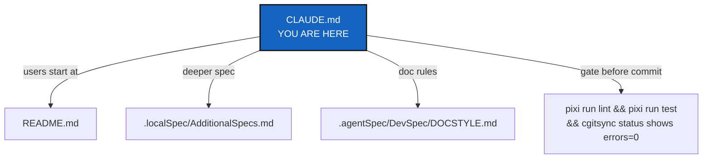

# ComplexGitSync

## Abstract — read this first

**What this document is.** The instructions for anyone — human or coding
agent — doing development work in this repo: commands, the before-committing
checklist, and the architecture boundary.

**Why it exists.** `pixi run lint`/`test`/`bump-version`, the module
responsibility table, and the ring-import rules must be followed identically
by every contributor; this file is the one place that states them.

**What you will find.** The Pixi command set, how to bootstrap a
live-editable checkout, a before-committing checklist, the module
responsibility table and architecture boundary, file formats, repo layout,
and document conventions.

**Who it is for.** Anyone changing code or docs in this repo. End users only
need [README.md](README.md); this file is for development, not usage.

**What you need to do with it.** Follow it as written — it overrides default
behavior — before making any change, and run its before-committing checklist
before every commit.



---

CLI (`cgitsync`) that synchronises a multi-repository Git workspace (a tree of
nested repos) from a hand-written `.cgs` spec and a generated `.gts` state
snapshot. See [README.md](README.md) for user-facing docs and CLI usage.

## Commands

This project uses Pixi, not bare `pip`/`venv`.

```bash
pixi install         # create/update the environment (run after touching pixi.toml or dependencies)
pixi run test        # pytest, tests/unit + tests/integration
pixi run lint        # ruff check .
pixi run bump-version  # bump YYYY.XX and sync every manifest and doc (see below)
```

CI (`.github/workflows/ci.yml`) runs both `lint` and `test` on push/PR to
`main`/`lechat`. Run both locally before pushing.

### Bootstrapping a working checkout

ComplexGitSync manages itself as a multi-repo tree: a fresh `git clone`
alone gets you the code but not `docs/`, `.agentSpec/`, `.localSpec/`, or
`.claude/`. Use `bootstrap` pointed at **`examples/complexgitsync4dev.cgs`**
— the developer spec — to get a fully populated, independently
live-editable checkout. (The root `install.cgs` is the *user* install: the
tool and its documentation only. Bootstrapping that one leaves you without
the specs you are reading.)

```bash
git clone https://github.com/flipoyo/ComplexGitSync.git
cd ComplexGitSync
pixi install

pixi run cgitsync bootstrap examples/complexgitsync4dev.cgs ComplexGitSync
# Copy the export command from bootstrap's own output, or use:
export CGSHOME=/home/user/.cgs/CGS20260831131233/ComplexGitSync

cd "$CGSHOME"       # this *is* the freshly cloned ComplexGitSync checkout —
pixi install        # bootstrap clones a plain checkout, so it needs its own
                     # pixi environment before you can run cgitsync from here
```

`$CGSHOME` now holds `ComplexGitSync` (mounted at its own root — the tree's
project entry), `docs/` (`DocComplexGitSync`), `.agentSpec/`, `.localSpec/`,
and `.claude/` cloned side by side. `pixi.toml`'s
`complexgitsync = { path = ".", editable = true }` makes
this checkout self-editable the moment that second `pixi install` finishes:
edit any file under `src/ComplexGitSync/`, then `pixi run cgitsync ...` from
inside `$CGSHOME` picks up the change immediately — no reinstall step, no
separate `pip install -e .`.

## Before committing

Do all of these as part of the change, not as a follow-up:

1. **`pixi run lint` and `pixi run test` must both pass.** The full suite
   must pass before any merge to main, and before any task is considered
   closed (`DevSpecs.md`, *Testing*).
2. **`cgitsync status`, run from this tree's own root, must show
   `errors=0`.** A green test suite proves the code works in isolation; it
   does not prove `cgitsync` can still describe the tree it is actually
   dogfooding itself against (`DevSpecs.md`, *Testing*). A row reading
   `error`/`error` — a repository whose branch has no commit for `git
   rev-parse HEAD` to resolve, most often — means a change left a real,
   tracked repository in a state the tool cannot read, which no unit test
   over a fixture would have caught. Fix the repository, or the code that
   left it that way, before calling a task finished; do not just note the
   error and move on.
3. **Run `pixi run bump-version`** when wrapping up a feature branch, ahead
   of the auto-increment CI performs on merge to main (`DevSpecs.md`,
   *Versioning*; `.localSpec/AdditionalSpecs.md`). `pyproject.toml` holds the
   authoritative `YYYY.XX` version; the one command syncs `pixi.toml`,
   `src/ComplexGitSync/__init__.py`, the README title, and the
   `\cgsversion` macro in `docs/Setup/Shortcuts.tex` and
   `docs/preamble.tex`. DevSpecs requires a single command for this —
   never hand-edit those version fields. `--dry-run` previews it.
4. **Rebuild the docs if you changed them.** `bump-version` rewrites `.tex`
   sources but does *not* regenerate the tracked PDFs:
   `cd docs && latexmk -pdf MASTER.tex` (plus each `c_*.tex` you touched).
5. **Update `.localSpec/AdditionalSpecs.md`'s architecture section** if
   module responsibility moved (see below).
6. **Document any new CLI command** in the README command table *and*
   `docs/Text/user_guide.tex`, and its client method in
   `docs/Text/api_python.tex`. The README half is enforced by
   `tests/unit/test_cli_smoke.py::test_readme_documents_every_cli_command`.
7. **Deliver the commit message.** Finishing a ticket includes writing
   the commit message for the repositories the change touched — the
   project's own and each mounted configuration repository that changed.
   Deliver it as text in the finishing report; whether to commit is the
   owner's call unless the owner asks for it.

   **Never `push` without being asked, in any repository, on any
   branch.** No ruleset on this remote stops an agent running under the
   owner's own credentials — `main`'s `maintainerClearance` ruleset
   bypasses Admin, always, and the account these commands run as has that
   role. The only barrier is this rule. Commit locally, deliver the
   message, and stop — `push` (or `memory push`, or anything that reaches
   a remote) is a separate, explicit request every time, not something a
   finished ticket implies. Approval to push once does not carry to the
   next command, the next ticket, or the next session.

   **Starts with `<project-name><version>`. One message. Plain English.
   Three lines at most.**

   - **Starts with `<project-name><version>`.** The project's own name —
     `cgitsync` — immediately followed by `pyproject.toml`'s current
     version, no space and no `v` (`cgitsync2.76`, never `cgitsync 2.76`
     or `cgitsync v2.76`). Run `pixi run bump-version` (step 3 above)
     before writing the message, so the version it reads is current. This
     is what lets a reader scanning `git log` tell which release a change
     shipped in without cross-referencing anything else.
   - **One message.** Write the *same* message for `commit` and for
     `commit --private`. One change is one story, and a project
     repository and the configuration repository that goes with it are
     two halves of that story, not two stories. Do not write a variant
     per repository.
   - **Plain English.** Say what the change does for the person using the
     tool, in words they would use. This is a deliberate tightening of
     [.agentSpec/DevSpec/DOCSTYLE.md](.agentSpec/DevSpec/DOCSTYLE.md)
     §5, which exempts commit messages — here they are not exempt. The
     reader is somebody scanning `git log` months later, not somebody
     holding the diff.
   - **Three lines at most.** The whole message, not three paragraphs and
     not a subject line plus three. No bullet lists, no file inventories,
     no ticket numbers: the diff already says which files moved, and the
     archived ticket already says why.

   This governs the messages you write. It says nothing about the
   messages ComplexGitSync generates for itself, such as the
   `--commit-gitignore` one.

## Attribution

**The agent is not credited on commits.** No `Co-Authored-By` trailer and
no "generated with" line on any commit, merge, or pull request, in any
repository of this tree.

Work done by an LLM agent under contract is a paid service, not
authorship. Publishing and the scientific world already draw this line:
paid assistance is acknowledged, not co-signed. Co-authorship would be the
right word for work given freely; it is the wrong word for work invoiced.

### Two rules, because naming an agent serves two different purposes

Credit and accountability are not the same thing, and they do not belong
in the same place. One is published; the other is nobody's business but
the people doing the work.

**The publication rule — public, and one place only.** The agent is named
in [README.md](README.md)'s *LLM assistance* section, and in no other
public place. Keep that section current: it is the whole of the credit,
so it carries the honesty the commit trailers would otherwise have
carried. It names the tools used on this project; it does not name who
did which piece of work, because credit at that granularity is exactly
the co-signature the section above refuses.

**The accounting rule — private, and never published.** What each agent
actually did belongs in `.cgitsync/.memory/.self-history`: which ticket
was served, which agent and role acted, its vendor and model version, the
States the work moved between, and how far the specs were followed. That
is a record of work performed under contract, not a by-line — the same
distinction that makes paid assistance acknowledged rather than
co-signed, applied to the other half of the question.

It stays private for the reason the whole planning surface is private:
how the work is decided and who did which part is internal, while the
product is public. `.memory` is `private = true`, it is pushed only to a
private repository, and privacy propagates to everything nested inside
it. **A self-history record must never reach a public repository**, and
nothing in it may be copied into one.

Neither rule licenses the other. Naming an agent in the accounting record
is not permission to name it on a commit, and the README's credit is not
a summary of the accounting.

The **AgentReport** ticket in `.localSpec/DevTickets/` carries the
record's fields and the conformity score it holds — cited by name, not by
path, because a ticket is renamed when it is archived. Until it lands
there is nothing to write: the publication rule above is in force today,
the accounting rule says where the record will go.

## Architecture boundary

The module responsibilities are strict and audited — see
[.localSpec/AdditionalSpecs.md](.localSpec/AdditionalSpecs.md)'s
"Architectural Overview" section for the full write-up, including the
"Ring" vocabulary (`Ring-0`…`Ring-4`, an import-direction/I/O-boundary
grouping) the table below already uses. Summary:

Update `.localSpec/AdditionalSpecs.md`'s responsibility table and
dependency-path diagram whenever a task adds, removes, or moves module
responsibility (new module, changed delegation, changed boundary) — before
committing, as part of that task's change, not as a separate follow-up.

| Module | Responsibility |
|---|---|
| `cgs_format.py` | `.cgs` TOML parsing/authoring grammar, normalization, static validation, `CgsDocument`, serialization. Deterministic and offline at its core — no `subprocess`, no Git, no remote calls; its `ConfigDocumentIOMixin`-derived file I/O is the one explicit Ring-1 exception. |
| `git_repo.py` | Canonical repository identity, provider registry, remote URL construction, per-repository runtime state. Owns `RepoScope`: which repositories a tree-wide command may write. `private` = a repository that configures the project rather than being it, read-only unless the entry adds `writable = true`; `--private` targets the writable ones. Scope reads the *effective* flags — `git_tree.propagate_privacy` pushes a parent's privacy onto everything nested inside it. |
| `git_branch.py` | The only implementation of the `.cgs` branch fallback chain (`fallback_branch` → `default_branch` → `project.default_branch` → `DEFAULT_BRANCH`) and of the privacy rule — including the private/local naming rule (`private_local_branch`): `<project name>` on `main`, `<project name>_<branch>` otherwise. Its separator constant never leaves this module. Also owns the closed-branch naming rule: `closed_branch_name` (`closed/<branch>`, a `/` that can never collide with `private_local_branch`'s `_`) and `closeable` (false for the project's own default branch). Ring 0 — pure, offline; a resolver, not a registry: it holds no tree and no privacy state (`git_tree_branch.py` holds the tree's branch state and asks this module for every rule). Do not write a second copy of that chain anywhere. |
| `git_tree_branch.py` | The tree's branch *state*, where `git_branch.py` owns the *rule*: which branch the tree is on (the root's — printed by `status` as `cgitsync_branch`), which branch each repository targets when the tree moves, which branch it is actually on, and where those two disagree. Also owns `tree_project_name`. It restates no rule — every answer comes from `git_branch.py` — and it is the only place that reads the root's branch to speak for the tree. An instance caches what Git said, so build a new one after a checkout or a pull. |
| `git_tree.py` | Tree structures (`GitTree`/`WorkingGitTree`), traversal, lifecycle state; `to_cgs()` only delegates to `cgs_format.py`. Also maintains `.gitignore` across the tree (`sync_gitignore`) — filesystem-only, no Git/subprocess. Owns privacy state: `propagate_privacy` makes a parent's `private`/`writable` cover everything nested inside it. |
| `gts_document.py` | `.gts` runtime state-snapshot parsing/validation; the one canonical content-hash builder. That hash **names the State** (`.cgitsync/state/<hash>.gts`), so it holds only what the workspace *is*: tree-relative paths, refs, commits, who each repository is. No absolute path, no `source_cgs_path`, no toolchain version — those say where a tree was materialised or what observed it, and hashing them gave one tree two names on two machines. `document.hash_canonicalisation` says which algorithm measured a document; a snapshot is always checked with the version it declares and is never silently re-measured. A document declaring a version higher than this build knows is refused by name (`UnsupportedSnapshotFormatError`) before any hash is computed — never recomputed under today's rules and reported as a false mismatch. See `.localSpec/AdditionalSpecs.md`, *What a State's name is computed from*. |
| `git_runner.py` | Git subprocess wrapper — the sole `import subprocess` module, and the sole owner of how Git's output is decoded (`errors="replace"` at both wrappers; `_query_bytes` for callers that must search raw bytes) and of the environment Git runs in: `_non_interactive_git_env()` stops Git prompting for credentials *and* pins its message locale to English, because this project reads Git's prose and a translated message costs a non-English user the `--force-protocol` hint. Every question goes through `_query`/`_query_bytes`, so neither policy can be bypassed. `merge`/`fetch`/`mergetool` are operations; `can_merge_cleanly`/`branch_known`/`configured_merge_tool` are read-only questions that never touch a worktree, which is what lets a preflight ask about every repo before acting on any. `can_merge_cleanly` returns the conflicting paths, not a verdict, and counts a binary conflict — which prints no marker and is named on stderr — as a conflict. |
| `clone_guard.py` | Whether a directory `initialise` is about to delete and re-clone holds work that exists nowhere else: a dirty worktree, or commits no remote has. Read-only and worktree-free, so `orchestre.py` can ask about every pending repository before deleting any — a refusal leaves the whole tree on disk. Asks "which commits does no remote hold?", not "is this branch ahead of its upstream", so a detached `HEAD` on a pinned submodule commit does not block. Says nothing about whether a mount point is owned outright. |
| `operations.py` | Leaf/parent-first Git operations over a `WorkingGitTree` + `GitRunner`. Preflight checks only the repositories the operation's `RepoScope` selects, and measures a private repo against its own declared branch. `merge_tree` checks the whole scope before merging any of it, so a conflict anywhere leaves nothing merged; `merge_tree_one_at_a_time` (`merge --resolve`) gives that up on purpose, stopping at the first conflict so a merge tool has a conflicted worktree to open. `merge_status` is the single place a repository's fate is decided, so the dry run and the merge cannot disagree. `add_tree`/`commit_tree`/`push_tree`/`remove_paths` return one `RepoOutcome` per repository visited — what changed, or why nothing did — so "nothing happened" is reportable rather than silent. `remove_paths` is the one scoped operation given its paths instead of sweeping for them, so its scope is a *filter*: a path owned by a repository outside the scope is refused by name, and nothing is removed anywhere. `close_branch` renames a branch to `git_branch.closed_branch_name`'s name, tree-wide leaf-first, never deletes, and refuses before touching any repository when the branch is the project's own default or any repository in scope is currently checked out on it. |
| `registry.py` | Translates `.cgs`/`.gts` documents to/from `WorkingGitTree`. **The `.gts` prevails over the `.cgs`** — a snapshot is the attested state, and a hand-edited `.cgs` must never be able to widen write access behind it. |
| `settings.py` | Where workspaces live (`$CGSPATH`, else `$HOME/.cgs`), the default workspace a command falls back to when discovery finds nothing — created once, recorded in `$HOME/.cgs/default`, holding an empty but valid `.gts` that never claims to be `READY` — the other workspaces the CLI offers as a hint, and the `STANDALONE`/`NESTED` use case, derived from whether the running installation sits inside the resolved CGSHOME. Answers all of it before a workspace is open, which `master.py` cannot. |
| `paths.py`, `state_store.py`, `discovery.py`, `status_render.py`, `snapshot_resolver.py` | Path/CGSHOME resolution, state-directory allocation, nested-config/`.gitmodules` discovery, pure status-table rendering (including the `SCOPE` column's user-facing wording: `project` / `private/local` / `private/distant` for project / private+writable / private read-only), and default-`.gts`-snapshot resolution — each extracted from `orchestre.py`/`cli/` during the isolation work (`.localSpec/DevTickets/archive/20260828_Isolation_DevPlanTicket.md`). `snapshot_resolver.py`'s `describe_*` functions also carry *which input* chose the workspace (`--search-dir` > `$CGSHOME` > current directory) so `cli/` can print it and warn when the resolved CGSHOME does not contain the current directory; the module itself never prints. |
| `universal_clock.py` | The sole reader of the real wall clock, high-resolution counter, PID and entropy source anywhere in `src/`. Defines `ClockProtocol` — the injectable interface every dated fact this project writes goes through — and `SystemClock`, the one real implementation. Every other module accepts a `clock: ClockProtocol` rather than reading `datetime`/`time`/`os`/`secrets` itself, checked unconditionally by `pixi run check-ceilings` the same way `subprocess` confinement is. `memory/ledger_entry.py` (Ring 0) keeps a structurally identical `ClockProtocol` of its own rather than importing this (Ring 1) module's — Ring 0 must be self-contained — and Python's structural typing makes the two interchangeable at every call site regardless. |
| `memory/` | Everything a workspace remembers, including `repository.py`: what it takes for a memory to *be* a repository — the `.cgs` entry mounting it at `.cgitsync`, which branch of the shared `.memory` repository this project uses, the message its own commit carries — while still running no Git itself. A State records exactly one machine path, the tree's own root; everything else is written against the tree as `$CGSTREE/...`, because a memory gets pushed. The rest of the package: the State area (`states.py`), the hash-chained ledger (`ledger_entry.py`, `ledger_store.py`), what each `commit` wrote and each `push` published (`commit_log.py`), what `verify` checks (`integrity.py`), the State writer and the legacy single-file register kept for reading (`store.py`). Every command that writes a State appends one entry, carrying the toolchain that produced it. **Nothing here runs Git** — when a memory becomes a repository, that work belongs to `operations.py`/`git_runner.py`, driven by this package. `snapshot_resolver.py` stays outside it. |
| `toolchain.py` | The five version strings a ledger entry records, read at most once per process and reported as `none` when a tool is not installed. Asks `git_runner.tool_version`, so no second module imports `subprocess`. Versions are provenance, never identity: they never enter a State's name. |
| `orchestre.py` | The `ComplexGitSyncClient` public facade and `Orchestre` coordination layer; delegates to every module above rather than re-implementing them; still owns run logging and the `.lgr` register/sync ledger directly. |
| `config_document.py` / `config_document_io.py` | Format-neutral `ConfigDocument` base (pure) and its file-I/O mixin (Ring 1), shared by `CgsDocument`/`GtsDocument`. |
| `master.py` | Workspace-local Git identity (`MasterConfig`) for ComplexGitSync's own automated commits; defaults to local git config, overridable/persisted per `CGSHOME` via `.cgitsync/master.toml` — not part of the `.cgs`/`.gts` project spec. |
| `json_render.py` | The shape of every machine-readable answer (`status --json`, `verify --json`, and the error object a JSON-capable command prints when it fails), plus `SCHEMA_VERSION` and the serialiser. Defined once for all commands, never in `cli/`. Kept apart from `status_render.py` because a table column may be reworded and a JSON field may not — something is parsing it. Additive only: fields may be added, never repurposed or removed. |
| `cli/` | Argument/prompt collection only, including `exit_codes.py`: the three documented codes and the mapping from an expected failure to one of them, which returns `None` for anything unrecognised so a defect still reaches the user as a traceback; delegates all `.cgs`/`.gts` semantics downstream. `_shared.py` (cross-command helpers) + `minimalist.py`/`expert.py`/`configuration.py` (one module per command group, README's own grouping) + `suggest.py` (names the command a mistyped one most likely meant, after argparse has had its say — advice only: it never rewrites the arguments, runs the command it names, or changes argparse's exit code) + `__init__.py` (assembles the parser, exposes `main`). |

See [.localSpec/AdditionalSpecs.md](.localSpec/AdditionalSpecs.md) for the
full module/ring table and its ring-import rules (downward-only imports,
`subprocess` confinement, Ring-0 purity, the ceiling ratchet) this boundary
is checked against; [.localSpec/audit.md](.localSpec/audit.md) tracks actual
audit findings, not the architecture reference itself.

Data flow: `CLI / Python caller → ComplexGitSyncClient.configure() → cgs_format.py → CgsDocument → GitTree → orchestre.py → registry.py / operations.py → GitRepo / git_runner.py`.

`parse_repo_id()` in `cgs_format.py` is the *only* repo-identifier parser —
don't add another one in `cli/`, `git_tree.py`, `git_repo.py`, or
`orchestre.py`. The same rule holds for branches: `git_branch.py` is the
*only* implementation of the `.cgs` branch fallback chain and of the
privacy rule — it was six private copies across five modules before that
module existed. Keep parsing/validation offline-safe; only explicit runtime
Git operations may touch the network.

**The CLI mirrors the Python API.** End users only use the CLI, so every
capability must exist in both layers: implement it as a
`ComplexGitSyncClient` method carrying all the semantics, then wire a thin
`_handle_*` → `_execute_*` pair in the owning `cli/<group>.py` module (per
README's Minimalist/Expert/Configuration grouping) that collects arguments,
calls that one method, and prints. A client method with no CLI surface is
unreachable for users; a CLI command with logic of its own breaks the
mirror. `cli/` must never touch `subprocess`/Git or parse repository
identifiers.

## File formats

- `.cgs` ("ComplexGitSync") — hand-written project topology/spec (TOML).
- `.gts` ("GitTreeState") — generated workspace snapshot.
- `.lgr` ("LocalGitRegister") — generated local register / append-only sync ledger.

## Layout

- `src/ComplexGitSync/` — package source.
- `tests/unit/`, `tests/integration/` — pytest suites (`pixi run test` runs both).
- `examples/*.cgs`, `*.gts` — sample specs used in docs/tests.
- `install.cgs` — the **user** install: ComplexGitSync and its
  documentation, and nothing that configures how the project is developed.
  It mounts no private repository, and `nested_config` on `docs` is
  `disabled` so `docs/DocCGS.cgs` does not pull in `DocSpec`.
- `examples/complexgitsync4dev.cgs` — the **developer** install: the same
  two repositories plus `.agentSpec`, `.localSpec`, `.claude`, and — since
  `memory-dev_1-2_MemoryOnboarding`, 2026-09-17 — `.memory`, mounted at
  `.cgitsync`, this project's own pushed memory. This is what makes
  ComplexGitSync manage its own working tree, and what *Bootstrapping a
  working checkout* above uses. It is also `tutorials/04_private_repos.md`'s
  worked example and what CI dogfoods, being the only checked-in spec that
  uses every kind of private entry.
  The two files are not duplicates — one installs the tool, the other
  installs the workshop. Only `install.cgs` sits at the repository root:
  where a `.cgs` lives never affects the tree it describes, since the root
  is CGSHOME resolved from `--output-path`/`$CGSHOME` plus `project.name`.
- `docs/` — LaTeX-built reference docs; generated `.aux`/`.log`/etc. are gitignored, the built PDFs are tracked.
- `CLAUDE.md` (this file) and `AGENT.md` — tracked at the project root only
  as symbolic links into `.claude/`, a mount of `flipoyo/claude` (branch
  `ComplexGitSync`) holding the real files plus `settings.json`. `AGENT.md`
  is a minimal pointer stating the reading order (this file, then
  `.localSpec/` and `.agentSpec/`); it carries no rules of its own.
- `.localSpec/` — a mount of `flipoyo/.localSpec` (branch `ComplexGitSync`):
  `AdditionalSpecs.md` (deeper spec/authoring reference beyond this file),
  `AGENT.md` (the roster of specialized agent roles for parallel multi-agent
  work on this project — Dev, CI/CD, Editing, Orchestration, Maths,
  Scientific editing — and how they hand off work), `audit.md`
  (findings, legacy references, open decisions/risks), and `DevTickets/`
  (the planning surface — see the next bullet).
- `.agentSpec/` — a mount of `flipoyo/.agentSpec` (branch `main`, shared
  across every project that uses it), holding `TICKETLIFECYCLE.md` and its
  own `install.cgs`, which mounts `flipoyo/DevSpec` one level deeper at
  `.agentSpec/DevSpec/`: `DevSpecs.md` (the project-agnostic philosophy
  `.localSpec/AdditionalSpecs.md` and this file conform to), `DOCSTYLE.md`,
  and a generic `AGENT.md` template.
- `.localSpec/DevTickets/` — **the planning surface, and it is private**;
  the public repository holds no tickets at all. Four things live there,
  and nothing else:
  [`README.md`](.localSpec/DevTickets/README.md) (the loop below, in full),
  `shortTickets/` (the owner's requests, in their own words),
  `openTickets/` (the ranked plans, each named
  `<branch>_<priority>-<rank>_<Name>_DevPlanTicket.md` — `main_` for
  ordinary work, `memory-dev_` for the memory workstream), and `archive/`
  for completed/superseded plans, stamped `YYYYMMDD_`, with
  `archive/.closedUserTicket/` for short tickets that have been acted on.
  **The loop:** the owner writes a short ticket; on their word the agent
  brings every open ticket and every spec into line with it, in one pass;
  the short ticket is then stamped and moved to `archive/.closedUserTicket/`
  in that same change. A request made in conversation is written down and
  filed the same way, so what was asked for does not live only in a chat
  log.

## Document conventions

Follow [.agentSpec/DevSpec/DOCSTYLE.md](.agentSpec/DevSpec/DOCSTYLE.md) for how any Markdown
document in this repo is written — abstract first, mermaid graph, audience
separation, length, one authoritative file per purpose. It applies to every
`README.md`, spec, and file under `docs/`.

Write in straightforward English, not IT-entangled sentences — favour
common words over jargon, expand acronyms on first use, and keep sentences
short enough to read once. This bar is strictest for `tutorials/`,
`README.md`, and `docs/Text/*.tex`, since their reader has no other
context to lean on; see DOCSTYLE.md §5 for the full rule, worked examples,
and where it loosens.

**This includes the report you write when you finish a task**, and there
the bar is strictest of all. Say what works now, what changed, what is
unfinished, and what the reader must decide — in that order, in short
sentences, naming files and commands rather than describing them. The
reader has been away from the task and should not have to decode the
summary to find out where things stand. DOCSTYLE.md §5 carries the full
rule.

Every created document — specs (`.agentSpec/DevSpec/DevSpecs.md`, `.localSpec/AdditionalSpecs.md`),
planning tickets (`DevPlan*.md`, `DevPlanTickets*.md`, `CorPlan.md`-style
plans), `.localSpec/audit.md`, `README.md`, and `docs/tutorials/*.md` — opens with a
`*Created: YYYY-MM-DD*` line directly under its `# ` title, set once at
authoring time and never rewritten on later edits. It records when the
document was written, not when it was last touched: a "last updated" claim
rots the moment someone forgets to bump it, which `.agentSpec/DevSpec/DOCSTYLE.md`
§6 already forbids ("no stale-by-design content"); a creation date is a
historical fact and cannot go stale the same way.

Planning tickets additionally carry a filename lifecycle. An open ticket
lives in `.localSpec/DevTickets/openTickets/` as
`<branch>_<priority>-<rank>_<Name>_DevPlanTicket.md`. `<branch>` is the
branch the work lands on, always written out and `main` when nothing else
applies; `<priority>` is `1` (prioritary — pick it up now) or `2`
(stand-by — real work, not now); and `<rank>` is its position in that
priority's own pile, counted from 1. A new ticket is appended to the end of
its pile; a Ticket review re-ranks both piles by importance and compacts
them so each runs 1..N. Once the ticket's work is implemented, the
`<branch>_<priority>-<rank>_` prefixes are replaced by a `YYYYMMDD_` stamp
and the file moves to `.localSpec/DevTickets/archive/`, in the same commit
that implements it.
[.agentSpec/TICKETLIFECYCLE.md](.agentSpec/TICKETLIFECYCLE.md) is the
authoritative statement of that rule — read it before opening or finishing
a ticket.

Every ticket also states the branch its work lands on, as a
`*Branch: <name>*` line under its `*Created:*` line, saying the same thing
its filename says. **`main` for everything except two workstreams**: memory
work is developed on `memory-dev` — `.cgitsync/`, the state area, the
register/ledger, the `memory/` package, and the distant reference ledger —
and the data layer on `data-repo` — the `DataManager`, the DVC backend,
`data_backend`/`data_paths`, and data materialisation and publication. So a
memory ticket is
`.localSpec/DevTickets/openTickets/memory-dev_<priority>-<rank>_<Name>_DevPlanTicket.md`,
a data ticket `data-repo_<priority>-<rank>_<Name>_DevPlanTicket.md`, and
everything else `main_<priority>-<rank>_<Name>_DevPlanTicket.md`.
`.localSpec/AdditionalSpecs.md`'s *Branches and ticket topics* section is
the authoritative list of which branches this project has;
TICKETLIFECYCLE.md §2.3 and §3 define the two conventions themselves.

Standalone LaTeX documents (`docs/*.tex` with their own `\documentclass`)
already carry `\date{\today}` on the title page — keep this on any new one.
