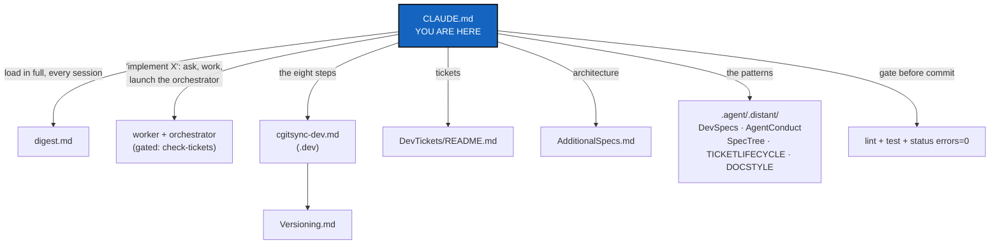

# ComplexGitSync

*Created: 2026-08-31*

*Fills in: ../../.distant/dev-sync/SpecTree.md*

## Abstract — read this first

**What this document is.** The map for anyone — human or coding agent —
doing development work in this repo: what to load first, where each kind of
rule lives, and the titles of the eight steps that finish a change. It holds
no command and no rule that is stated elsewhere.

**Why it exists.** The rules used to be written here, in full, and again in
three other files, and the copies drifted. Every agentic topic now has a
shared *pattern* in `.agent/.distant/` and, where this project makes a
choice, one short *fill-in* in `.agent/.local/` that opens with a
`*Fills in:*` line ([SpecTree.md](../../.distant/dev-sync/SpecTree.md) §2).
This file is the way in.

**What you will find.** What the project is, the two installs, the layout of
the two levels, what to do when the owner says `implement <ticket>`, the
eight checklist steps, and the few rules that have no other home.

**Who it is for.** Anyone changing code or docs in this repo. End users only
need [README.md](../../../README.md); this file is for development.

**What you need to do with it.** **Load [digest.md](../.localSpec/digest.md)
in full, now:** it is every `MUST`/`NEVER` rule this spec tree states, one
line each, short enough to read in a session's opening moments, so a rule
like "an agent is never credited on a commit" sits in view instead of two
hops behind a pointer. Then follow the steps below, and read the fill-in a
step points to.

```mermaid
graph TD
    CLAUDE["CLAUDE.md<br/>YOU ARE HERE"] -->|"load in full, every session"| DIGEST["digest.md"]
    CLAUDE -->|"'implement X': ask, work,<br/>launch the orchestrator"| PAIR["worker + orchestrator<br/>(gated: check-tickets)"]
    CLAUDE -->|"the eight steps"| DEV["cgitsync-dev.md<br/>(.dev)"]
    DEV --> VER["Versioning.md"]
    CLAUDE -->|"tickets"| TK["DevTickets/README.md"]
    CLAUDE -->|"architecture"| SPEC["AdditionalSpecs.md"]
    CLAUDE -->|"the patterns"| DIST[".agent/.distant/<br/>DevSpecs · AgentConduct<br/>SpecTree · TICKETLIFECYCLE · DOCSTYLE"]
    CLAUDE -->|"gate before commit"| CI["lint + test + status errors=0"]

    classDef here fill:#1565C0,color:#fff,stroke:#111,stroke-width:2px;
    class CLAUDE here;
```

---

`cgitsync` synchronises a multi-repository Git workspace (a tree of nested
repos) from a hand-written `.cgs` spec and a generated `.gts` state
snapshot. User-facing docs and CLI usage: [README.md](../../../README.md).
File formats: `.cgs` (hand-written topology, TOML), `.gts` (generated
snapshot), `.lgr` (generated local register / append-only sync ledger).

## Layout — the two installs and the two levels

- **`install.cgs`** (repository root) is the *user* install: the tool and
  its documentation. **`examples/complexgitsync4dev.cgs`** is the *developer*
  install: the same, plus every agentic mount and `.memory` at `.cgitsync`.
  It is what CI dogfoods and what you bootstrap from (`DevSpecs.md`, *Two
  installs*; the commands are in [cgitsync-dev.md](../.dev/cgitsync-dev.md)).
- `src/ComplexGitSync/` source; `tests/unit/`, `tests/integration/`;
  `examples/`; `docs/` (LaTeX, built PDFs tracked).
- **`.agent/`** is a plain directory, never a repository.
  [AgenticManifest.md](../.localSpec/AgenticManifest.md) is the one list of
  its mounts and spec files; `pixi run check-spectree` fails when it and the
  developer `.cgs` disagree. The path answers "may I edit this?":

| Under | Mount | Holds |
|---|---|---|
| `.agent/.distant/` — shared, **read-only** | `dev-sync` | [DevSpecs.md](../../.distant/dev-sync/DevSpecs.md), [AgentConduct.md](../../.distant/dev-sync/AgentConduct.md), [Versioning.md](../../.distant/dev-sync/Versioning.md), [SpecTree.md](../../.distant/dev-sync/SpecTree.md), the [AGENT.md](../../.distant/dev-sync/AGENT.md) template, [AgentDataContract.md](../../.distant/dev-sync/AgentDataContract.md) |
| | `ticket` | [TICKETLIFECYCLE.md](../../.distant/ticket/TICKETLIFECYCLE.md) |
| | `documentation` | [DOCSTYLE.md](../../.distant/documentation/DOCSTYLE.md) |
| `.agent/.local/` — **ours to write** | `.claude` | this file and `AGENT.md`, a pointer stating the reading order |
| | `.localSpec` | [AdditionalSpecs.md](../.localSpec/AdditionalSpecs.md) (architecture, the module table), [AGENT.md](../.localSpec/AGENT.md) (roles), [audit.md](../.localSpec/audit.md), [digest.md](../.localSpec/digest.md) |
| | `.dev` | [README.md](../.dev/README.md): the checklist ([cgitsync-dev.md](../.dev/cgitsync-dev.md)), [Versioning.md](../.dev/Versioning.md), and [DevTickets/](../.dev/DevTickets/README.md) — **private**; the public repository holds no tickets |

`CLAUDE.md` and `AGENT.md` at the project root are symbolic links into
`.agent/.local/.claude/`.

## When the owner says `implement <ticket>`

These are orders, not a description, and they come before the eight steps
(owner, 2026-10-09, PairRuleGate). Do them in this order.

1. **`implement <ticket>` is the explicit request for a subagent** that the
   harness's Agent tool asks for. Launching the orchestrator is not
   optional and needs no further permission.
2. **Read the ticket, then ask every open *Decisions for the owner* with
   `AskUserQuestion` before the first edit.** A recommendation is never the
   answer. A raise of a ceiling baseline is asked the same way.
3. **Implement as the worker**: code, tests, docs, `pixi run bump-build`.
   **Never** run `bump-version`, write a self-history record, or score your
   own work.
4. **Launch the orchestrator with the Agent tool, in the foreground.** Give
   it the ticket's name, every repository the diff touches, and the
   owner's answers. Tell it to quote the work against the eight steps,
   decide the version level, run `pixi run bump-version`, rebuild the PDFs,
   and write the record with `cgitsync self-history add`.
5. **Fix every defect it reports, then send the work back to the same
   orchestrator** for a re-quote. Repeat until it reports no blocking
   defect.
6. **Only then archive the ticket and deliver the commit message.**
   `pixi run check-tickets` and `cgitsync commit` refuse a planning ticket
   archived without its orchestrator's record.

Drafting, ranking or closing a ticket is orchestration already and
launches nobody. Why the pair exists and why it is written as orders:
[AgentConduct.md](../../.distant/dev-sync/AgentConduct.md) §4 and §4.1. This
block restates §4.1 on purpose, as this project's exception (owner,
2026-10-09): the orders bind only in the file every session loads.

## Before committing — the eight steps

Do all of them as part of the change, not as a follow-up. **Each step's
command and detail are in [cgitsync-dev.md](../.dev/cgitsync-dev.md)**; the
shape and the reason are [AgentConduct.md](../../.distant/dev-sync/AgentConduct.md) §1.

1. `pixi run lint` and `pixi run test` must both pass.
2. `pixi run bump-build` for any change under `src/`.
3. `cgitsync status`, run from this tree's own root, must show `errors=0`.
4. `pixi run bump-version {major,minor,patch}` after every `bump-build`, `patch` at least.
5. Rebuild the docs PDFs after every `bump-version` and every docs change.
6. Update `AdditionalSpecs.md`'s architecture section if module responsibility moved.
7. Document any new CLI command in the user guide and the API docs; never in `README.md`.
8. Deliver the commit message (`cgitsync<version>`, three lines) for every repository touched; never push without being asked.

The plans are in [DevTickets/](../.dev/DevTickets/README.md). The data
contract and the attribution rules (an agent is never credited on a commit;
the public front uses `vendor-name` and `model-name`) are filled in in
[cgitsync-dev.md](../.dev/cgitsync-dev.md).

## Architecture boundary

The module responsibilities, the ring model and the single-implementation
rules (`parse_repo_id()`, `git_branch.py`, `git_runner.py`,
`universal_clock.py`, the CLI mirroring the Python API) are in
[AdditionalSpecs.md](../.localSpec/AdditionalSpecs.md), *Responsibility
boundaries*. Data flow: `CLI / Python caller → ComplexGitSyncClient →
cgs_format.py → CgsDocument → GitTree → orchestre/ → registry.py /
operations/ → GitRepo / git_runner.py`.

## Document conventions

Follow [DOCSTYLE.md](../../.distant/documentation/DOCSTYLE.md) for every
Markdown document in this repo — abstract first, mermaid graph, audience
separation, length, one authoritative file per purpose. Every created
document opens with a `*Created: YYYY-MM-DD*` line, and a local spec with a
`*Fills in:*` line.

**One exception (owner, 2026-10-02): the project's root `README.md`.** It is
the user's front page, so it opens with the tool's name and what it is for,
not with an abstract and graph. It stays short and user-facing — step 7 says
what it holds and what it never does. Every other Markdown document, every
other `README.md` included, follows DOCSTYLE §1.

Planning tickets carry a filename lifecycle and a `*Branch:*` line, both in
[TICKETLIFECYCLE.md](../../.distant/ticket/TICKETLIFECYCLE.md); this
project's branches and prefixes are in
[DevTickets/README.md](../.dev/DevTickets/README.md).
